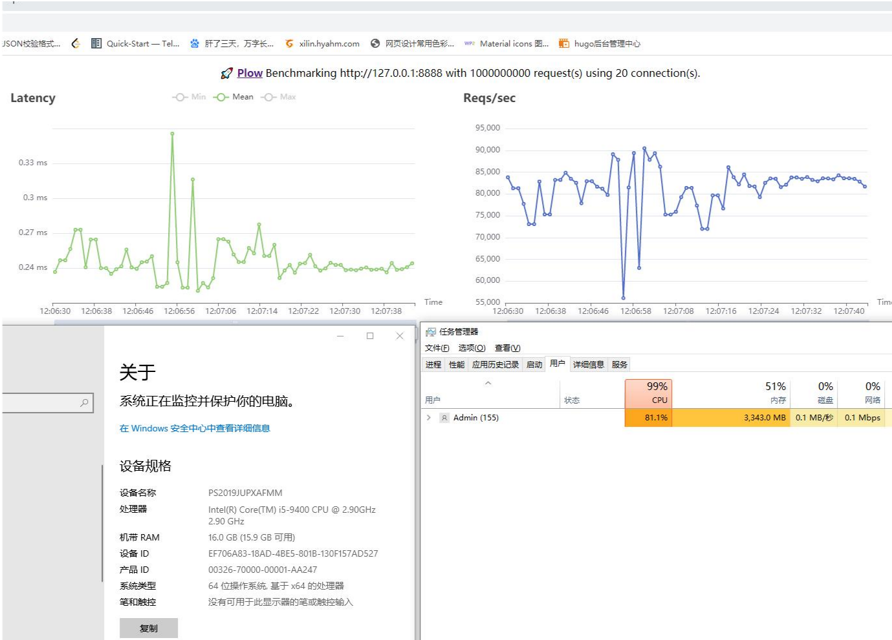

# xmux， go语言 路由(router)
应该是基于原生net.http 极简并强大的路由， 内嵌接口文档，告别另外写文档的烦恼   
专注前后端分离项目， 良好的设计可以大量减少代码冗余   

### 特性
- [x] xmux.NewGroupRoute()
- [x] 支持路由分组
- [x] 支持全局请求头， 组请求头， 私有请求头
- [x] 支持自定义method，
- [x] 支持正则匹配和参数获取
- [x] 完全匹配优先于正则匹配
- [x] 正则匹配支持（int(\d+), word(\w+), re, all(.*?)，不写默认 string([^\/])）建议使用string
- [x] 支持三大全局handle ,MethodnotFound(忘记写方法), MethodNotAllowed(method没定义), HandleNotFound(没有找到页面), Options请求）  
- [x] 强大的模块让你的代码模块化变得非常简单 
- [x] 中间件支持 
- [x] 内嵌接口文档
- [x] 数据绑定
- [x] 增加websocket， 可以学习，不建议使用, 如果其他的不好可以试试  
- [x] 集成pprof， router.AddGroup(xmux.Pprof())
- [x] 支持代理（参考于:  https://github.com/ouqiang/goproxy ）
- [x] 支持权限控制

### 安装
```
go get github.com/hyahm/xmux
```

### 最简单的运行
```
package main

import (
	"net/http"

	"github.com/hyahm/xmux"
)

func main() {
	router := xmux.NewRouter()
	router.Get("/", func(w http.ResponseWriter, r *http.Request) {
		w.Write([]byte("<h1>hello world!<h1>"))
	})
	router.Run()
}
```

打开 localhost:8080 就能看到 hello world!

### 添加了组的概念

> aritclegroup.go
```go
func hello(w http.ResponseWriter, r *http.Request) {
	fmt.Println(xmux.Var[r.URL.Path]["id"])
	w.Write([]byte("hello world!!!!"))
	return
}

var Article *xmux.GroupRoute

func init() {
	Article = xmux.NewGroupRoute()
	Article.Get("/{int:id}", hello)

}
```
> main.go
```go
func main() {
	router := xmux.NewRouter()
	router.AddGroup(aritclegroup.Article)
}
```
### 更灵活的匹配
```go
func main() {
	router := xmux.NewRouter()
	router.Get("/{all:age}", show)   // 这个可以匹配任何路由
	router.Post("/{all:age}", Who)   // 这个可以匹配任何路由
	router.Run()
}
```

记住， 是100%，  此路由优先匹配完全匹配规则， 匹配不到再寻找 正则匹配， 加快了寻址速度  
访问 /get -> 识别 show   
访问  /post   -> 识别 Who  

### 自动检测重复项,
```go
func main() {
	router := xmux.NewRouter()
	router.Get("/get",show) // 不同请求分别处理
	router.Get("/get",show) // 不同请求分别处理
	router.Run()
}
写一大堆路由，  有没有重复的都不知道  
运行上面将会报错， 如下  
2019/11/29 21:51:11 pattern duplicate for /get

```
###  自动格式化url
将任意多余的斜杠去掉例如
/asdf/sadf//asdfsadf/asdfsdaf////as///, 转为-》 /asdf/sadf/asdfsadf/asdfsdaf/as
```go
func main() {
	router := xmux.NewRouter()
	router.Slash = true
	router.Get("/get",show) // 不同请求分别处理
	router.Get("/get/",show) // 不同请求分别处理
	router.Run()
}

如果 router.Slash = false
那么运行上面将会报错，/get/被转为 /get 如下  
2019/11/29 21:51:11 pattern duplicate for /get

否则正常启动

```


### 三大全局handle
```go
HandleOptions:        handleoptions(),   //这个是全局的options 请求处理， 前端预请求免除每次都要写个预请求的处理, 默认会返回ok， 也可以自定义
HandleNotFound: 	  handleNotFound(),   // 默认返回404 ， 也可以自定义
HanleFavicon：        methodNotAllowed(),    // 默认请求 favicon

// 默认调用的方法如下， 没有找到路由
func handleNotFound() http.Handler {
	return http.HandlerFunc(func(w http.ResponseWriter, r *http.Request) {
		w.WriteHeader(http.StatusNotFound)
		return
	})
}

```

###  模块 （主要用来做验证， 比如token验证， 权限验证， 数据解析<需搭配Bind()>）

- 模块类 优先级   
全局路由 > 组路由 > 私有路由 (如果存在优先级大先执行，。 
如果不想用可以在不想使用的路由点或路由组 DelModule 来单独删除)
```go
func home(w http.ResponseWriter, r *http.Request) {
	w.Write([]byte("hello world home"))
	return
}

func mid() http.Handler {
	return http.HandlerFunc(func(w http.ResponseWriter, r *http.Request) {
		w.WriteHeader(http.StatusOK)
		fmt.Println("77777")
		return
	})
}

func hf(w http.ResponseWriter, r *http.Request)  bool {
	fmt.Println("44444444444444444444444444")
	r.Header.Set("name", "cander")
	
	return true
}

func hf1(w http.ResponseWriter, r *http.Request)  bool {
	fmt.Println("66666")
	fmt.Println(r.Header.Get("name"))
	return false
}

func main() {
	router := xmux.NewRouter().AddModule(hf).SetHeader("name", "cander")
	router.Get("/home/{test}",home).AddModule(hf1)  // 此处会先执行 hf -> hf1 -> home
	router.Get("/test/{test}",home).DelModule(hf)  // 此处直接执行 home
	router.Run()
}

```

### 中间件
- 中间件最多只能有一个， 功能较多建议使用模块  
优先级与header 一样， 中间件如下， 这是个计算执行时间的例子  
计算的时间不包含路由匹配和模块的时间  
```go
func GetExecTime(handle func(http.ResponseWriter, *http.Request), w http.ResponseWriter, r *http.Request) {
	start := time.Now()
	handle(w, r)
	fmt.Printf("url: %s -- addr: %s -- method: %s -- exectime: %f\n", r.URL.Path, r.RemoteAddr, r.Method, time.Since(start).Seconds())
}

```

### Enter, Exit 进入和退出的钩子
```go

func exit(start time.Time, w http.ResponseWriter, r *http.Request) {
	fmt.Println(time.Since(start).Seconds(), r.URL.Path)
}

func enter( w http.ResponseWriter, r *http.Request) {
	// 任何请求都会进入到这里
	fmt.Println(time.Since(start).Seconds(), r.URL.Path)
}

func main() {
	router := xmux.NewRouter().AddModule(hf).SetHeader("name", "cander")
	router.Exit = exit
	router.Enter = enter
	router.Get("/home/{test}",home).AddModule(hf1)  // 此处会先执行 hf -> hf1 -> home
	router.Get("/test/{test}",home).DelModule(hf)  // 此处直接执行 home
	router.Run()
}
```

### SetHeader 
跨域主要是添加请求头的问题, 其余框架一般都是借助中间件来设置   
但是本路由借助上面请求头设置 大大简化跨域配置  

优先级  
私有路由 > 组路由 > 全局路由  (如果存在优先级大的就覆盖优先级小的)

```go
// 跨域处理的例子， 设置下面的请求头后， 所有路由都将挂载上请求头， 
// 如果某些路由有单独请求头， 可以单独设置
func main() {
	router := xmux.NewRouter()
	router.Slash = true
	router.SetHeader("Access-Control-Allow-Origin", "*")  // 主要的解决跨域, 因为是全局的请求头， 所以后面增加的路由全部支持跨域
	router.SetHeader("Access-Control-Allow-Headers", "Content-Type,Access-Token,X-Token,Origin,smail,authorization")  // 新增加的请求头
	router.Get("/", index)
	router.Run()
}
```

### 适合在当前handle 的 module，  handle 传递值   
> 生命周期从定义开始， 到此handle执行完毕将被释放
```go
func filter(w http.ResponseWriter, r *http.Request) bool {
	fmt.Println("login mw")
	xmux.GetInstance(r).Set("name","xmux")
	r.Header.Set("bbb", "ccc")
	return false
}

func name(w http.ResponseWriter, r *http.Request) {
	name := xmux.GetInstance(r).Get("name").(string)
	w.Write([]byte("hello world " + name))
	return
}

func main() {
	router := xmux.NewRouter()
	router.Get("/aaa/{name}", name).AddModule(filter)  // 通过 xmux.GetInstance(r) 可以再在module handle 进行值的传递
	router.Run()
}

```


### 获取正则匹配的参数
```go
func Who(w http.ResponseWriter, r *http.Request) {
	fmt.Println(xmux.Var(r)["name"])
	fmt.Println(xmux.Var(r)["age"])
	w.Write([]byte("yes is mine"))
	return
}

func main() {
	router := xmux.NewRouter()
	router.Get("/aaa/{name}/{int:age}", Who)
	router.Run()
}
``` 
### 数据绑定（Bind(), 与Module 一起使用,DelModule必须放在AddModule之后）
将数据结构绑定到此 Handle 里， 通过读取r.Body 来解析数据
因为解析的代码都是一样的， 绑定后可以共用同一份代码

```go
func filter(w http.ResponseWriter, r *http.Request) bool {
	fmt.Println("login mw")
	xmux.GetInstance(r).Set("name","xmux")
	r.Header.Set("bbb", "ccc")
	return false
}

func name(w http.ResponseWriter, r *http.Request) {
	name := xmux.GetInstance(r).Get("name").(string)
	w.Write([]byte("hello world " + name))
	return
}

func JsonToStruct(w http.ResponseWriter, r *http.Request) bool {
	// 任何报错信息， 直接return true， 就是此handle 直接执行完毕了， 不继续向后面走了
	if goconfig.ReadBool("debug", false) {
		b, err := ioutil.ReadAll(r.Body)
		if err != nil {
			return true
		}
		err = json.Unmarshal(b, xmux.GetInstance(r).Data)
		if err != nil {
			return true
		}
	} else {
		err := json.NewDecoder(r.Body).Decode(xmux.GetInstance(r).Data)
		if err != nil {
			return true
		}

	}
	return false
}

type DataName struct {}
type DataStd struct {}
type DataFoo struct {}


func main() {
	router := xmux.NewRouter()
	router.Post("/important/name", handle.AddName).Bind(&DataName{}).AddMidware(midware.JsonToStruct)
	router.Post("/important/std", handle.AddStd).Bind(&DataStd{}).AddMidware(midware.JsonToStruct)
	router.Post("/important/foo", handle.AddFoo).Bind(&DataFoo{}).AddMidware(midware.JsonToStruct)
	// 也可以直接使用内置的
	router.Post("/important/foo", handle.AddFoo).BindJson(&DataFoo{})  // 如果是json格式的可以直接 BindJson 与上面是类似的效果
	router.Run()
}
```

### 自动修复请求的url
例如： 请求的url 是这个样子的
http://www.hyahm.com/mmm///af/af,  默认是请求不到的
但是设置后
```go
router := xmux.NewRouter()
router.Slash = true  
```
是可以直接访问 http://www.hyahm.com/mmm/af/af 这个地址的请求

### 匹配路由
支持以下5种   
 word   只匹配数字和字母下划线（默认）    
 string  匹配所有不含/的字符    
 int  匹配整数    
 all： 匹配所有的包括/   
 re： 自定义正则   
/aaa/{name}          这个和下面一个一样， 省略类型， 默认是string  
/aaa/{string:name}   这个和上面一样， string类型  
/aaa/{int:name}       这个匹配int类型   
/aaa/adf{re:([a-z]{1,4})sf([0-9]{0,10})sd:name,age}  这个是一段里面匹配了2个参数 name, age，   
大括号表示是个匹配规则，里面2个冒号分割了3部分 起头的  
第一个: re表示用到自定义正则，只有re才会有2个冒号分割,   
第二个： 正则表达式， 里面不能出现: 需要提取的参数用()括起来，   
第三个: 参数名， 前面有多少对()， 后面就需要匹配多少个参数， 用逗号分割   
例如： /aaa/adfaasf16sd  
这个是匹配的， name: aa   age: 16  
```
xmux.Var(r)["name"] 
```
后面会增加自定义正则匹配


### 内置websocket, 下面是一个完整的例子
```go
package main

import (
	"fmt"
	"log"
	"net/http"
	"sync"
	"time"

	"github.com/hyahm/xmux"
)

type client struct {
	msg string
	c   *xmux.BaseWs
}

var msgchan chan client
var wsmu sync.RWMutex
var ps map[*xmux.BaseWs]byte

func sendMsg() {
	for {
		c := <-msgchan
		for p := range ps {
			if c.c == p {
				// 不发给自己
				continue
			}
			fmt.Println(c.msg)
			// 发送的msg的长度不能超过 1<<31, 否则掉内容， 建议分包
			p.SendMessage([]byte(c.msg), ps[p])
		}
	}
}

func ws(w http.ResponseWriter, r *http.Request) {
	p, err := xmux.UpgradeWebSocket(w, r)
	if err != nil {
		w.Write([]byte(err.Error()))
		return
	}
	p.SendMessage([]byte("hello"), xmux.TypeMsg)
	wsmu.Lock()
	ps[p] = xmux.TypeMsg
	wsmu.Unlock()
	tt := time.NewTicker(time.Second * 2)
	go func() {
		for {
			<-tt.C
			if err := p.SendMessage([]byte(time.Now().String()), xmux.TypeMsg); err != nil {
				break
			}
		}
	}()
	for {
		if p.Conn == nil {
			return
		}
		// 封包
		msgType, msg, err := p.ReadMessage()
		if err != nil {
			fmt.Println(err.Error())
			// 连接断开
			wsmu.Lock()
			delete(ps, p)
			wsmu.Unlock()
			break
		}
		ps[p] = msgType
		c := client{
			msg: msg,
			c:   p,
		}
		msgchan <- c
	}
}

func main() {
	router := xmux.NewRouter()
	wsmu = sync.RWMutex{}
	msgchan = make(chan client, 100)
	ps = make(map[*xmux.BaseWs]byte)
	router.SetHeader("Access-Control-Allow-Origin", "*")
	router.Get("/{int:uid}", ws)

	go sendMsg()
	if err := http.ListenAndServe(":8080", router); err != nil {
		log.Fatal(err)
	}

}

```

### 获取当前的连接数
```go
xmux.GetConnents()
```

### 优雅的停止
```
xmux.StopService()
```


### 内置路由缓存
```go

xmux.NewRouter(cache ...uint64) // cache 是一个内置lru 路径缓存， 不写默认缓存10000， 请根据情况自己修改
```

###  权限控制
- 页面权限
思路来自前端框架路由组件 meta 的 roles  
通过给定数组来判断

- 细致的增删改查权限但不限于 增删改查
想过最简单的是根据 handle 的函数名 来判断
```go
// 页面权限示例 类似 setheader
// 
AddPageKeys("admin", "me", "xxx")  // 添加 roles 角色， 类似 前端路由的的roles字段
DelPageKeys("admin")  // 某些节点或组删除掉这些角色权限


// CURD 权限， 需要统一handle 函数命令才可以，  比如增删改查对应的 handle 就是
// Create  Update Delete List
// 通过 module 来过滤细致权限

func PermMudule(w http.ResponseWriter, r *http.Request) bool {
	// 通过类似 token 获取到用户的uid
	// uid := "from token" //
	// 直接写在token 验证路由里面或者 单独在加一个module 都可以
	// 根据uid 获取用户的CURD
	// 获取一个给定的结构存储函数对应的细致权限
	// 根据uid 判断自己有什么权限， 假如是retrieve 权限
	// ------------    这是开发给定的固定值  ，也可以放到map中---------------------
	// create := []string{"Create"} // 注意大小写方便判断
	retrieve := []string{"List", "Get"}
	// ------------    这是开发给定的固定值  ---------------------
	// 获取执行函数的方法名
	// 增删改查建议使用二进制对应  github.com/imroc/biu   1111  由二进制的某位对应一个权限
	currFun := xmux.GetInstance(r).Get(xmux.CURRFUNCNAME) // module 或 handle 中都必定有此 值
	// pages := xmux.GetInstance(r).Get(xmux.PAGES)          // 页面的权限， 一般都是假如到路由组 必定有此 值
	// 假如路由匹配到这里 func List(w w http.ResponseWriter, r *http.Request) {}  currFun = "List"
	// router.Post("/home", List)
	// 因为 currFun = "List" 所以 retrieve 中 包含了 List 也就是 权限符合
	// 增加switch 来判断多条件即可
	for _, v := range retrieve {
		if v == currFun {
			// 符合条件， 放行
			return false
		}
	}
	w.Write([]byte("no permission"))
	// 认证失败， 直接返回
	return true
}

// 注意在需要认证的路由中添加此module  AddModule(PermMudule) 即可完成， 后面权限控制全在这个module中
// 需要修改的也在此module 中修改， 而不用考虑逻辑代码
```

### 客户端文件下载（官方内置方法 mp4文件为例）
```go
func PlayVideo(w http.ResponseWriter, r *http.Request) {
	filename := xmux.Var(r)["filename"]
	f, err := os.Open(<mp4file>)
	if err != nil {
		w.WriteHeader(404)
		return
	}
	defer f.Close()
	w.Header().Set("Content-Type", "video/mp4")
	w.Header().Set("X-Download-Options", "noopen")
	http.ServeContent(w, r, filename, time.Now(), f)

```

### 客户端文件上传(官方内置方法)
```go
func UploadFile(w http.ResponseWriter, r *http.Request) {
	// 官方默认上传文件的大小最大是32M， 可以通过方法设置新的大小
	r.ParseMultipartForm(100 << 20)   // 100M
	// 读取文件
	file, header, err := r.FormFile("file")
	if err != nil {
		return
	}
	f, err := os.OpenFile(<storefilepath>, os.O_CREATE|os.O_WRONLY, 0644)
	if err != nil {
		return
	}
	defer f.Close()
	_, err := io.Copy(f, file)
	if err != nil {
		return
	}
}
```

### 编写接口文档， 
> 使用接口文档,  第一个参数是组路由名， 第二个参数是挂载的路由uri
== 组路由里面的静态文件 默认挂在 /-/css/xxx.css 和  /-/js/xxx.js 下 ==
== 动态路由   /-/api/{int}.html  ==

```go
// 所有的文档相关的方法都以Api开头， 文档只支持单路由的单请求方式， 多请求方式会乱, 调用的时候只会显示到当前位置以上的路由
router := xmux.NewRouter()
api := router.ShowApi("/doc")
router.ShowApi(api).
ApiCreateGroup("test", "api test", "apitest").  //增加了侧边栏 所有组路由或单路由必须加上这个才会显示, 第一个参数是组key, 第二个是组的标题， 第三个是侧边栏url显示的文字 ， 或者添加到某个组上 ApiAddGroup(key), 组路由添加的key 会被子路由继承， 如果不想显示可以ApiAddGroup 挂载到其他路由或者 ApiExitGroup， 移除此组
ApiDescribe("这是home接口的测试").  // 接口的简述
ApiReqHeader("content-type", "application/json"). // 接口请求头
ApiReqStruct(&Home{}).    // 接口请求参数， 由struct tag 提供（可以是结构体，也可以是结构体指针）
ApiRequestTemplate(`{"addr": "shenzhen", "people": 5}`).   // 接口请求示例
ApiResStruct(Call{}).     // 接口返回参数， 由struct tag 提供 （可以是结构体，也可以是结构体指针）
ApiResponseTemplate(`{"code": 0, "msg": ""}`).  // 接口返回示例
ApiSupplement("这个是接口的说明补充， 没补充就不填"). // 接口补充
ApiCodeField("133").    // 错误码字段
ApiCodeMsg("1", "56").ApiCodeMsg("3", "akhsdklfhl")   // 错误码说明， 多次调用添加多次
```
>  接口请求参数tag 示例
```
type Home struct {
	Addr   string `json:"addr" type:"string" need:"是" default:"深圳" information:"家庭住址"`
	People int    `json:"people" type:"int" need:"是" default:"1" information:"有多少个人"`
}
```
>  接口接收参数tag 示例, 比请求示例少了 default
```
type Call struct {
	Code int    `json:"code" type:"int" need:"是" information:"错误返回码"`
	Msg  string `json:"msg" type:"string" need:"否" information:"错误信息"`
}
```
### 压力测试
```
PS D:\myproject\xmux> go.exe test -benchmem -run=^$ -bench . github.com/hyahm/xmux -v                        
goos: windows
goarch: amd64
pkg: github.com/hyahm/xmux
BenchmarkOneRoute
BenchmarkOneRoute-6                      4536045               273.3 ns/op            93 B/op          0 allocs/op
BenchmarkRecoveryMiddleware
BenchmarkRecoveryMiddleware-6            4850932               248.7 ns/op            87 B/op          0 allocs/op
BenchmarkLoggerMiddleware
BenchmarkLoggerMiddleware-6              4829744               245.8 ns/op            87 B/op          0 allocs/op
BenchmarkManyHandlers
BenchmarkManyHandlers-6                  4821524               244.3 ns/op            87 B/op          0 allocs/op
Benchmark5Params
Benchmark5Params-6                       4471778               277.2 ns/op           142 B/op          1 allocs/op
BenchmarkOneRouteJSON
BenchmarkOneRouteJSON-6                  4873143               250.7 ns/op            86 B/op          0 allocs/op
BenchmarkOneRouteString
BenchmarkOneRouteString-6                4727139               248.4 ns/op            89 B/op          0 allocs/op
BenchmarkManyRoutesFist
BenchmarkManyRoutesFist-6                1518609               794.1 ns/op           408 B/op          5 allocs/op
BenchmarkManyRoutesLast
BenchmarkManyRoutesLast-6               51970549                22.34 ns/op            0 B/op          0 allocs/op
Benchmark404
Benchmark404-6                          10658811               111.5 ns/op             0 B/op          0 allocs/op
Benchmark404Many
Benchmark404Many-6                       9690430               123.1 ns/op             0 B/op          0 allocs/op
```

### plow 压力测试预览(因cpu满载中，效果不是真实的)


###  代理使用
```go
func main() {
	# proxy 也是一个路由
	proxy := NewProxy()
	log.Fatal(http.ListenAndServe(":8080", proxy))
}
```

