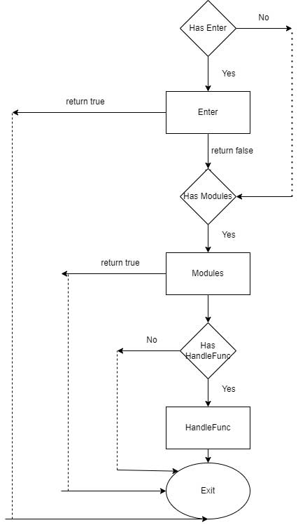

# xmux

Based on native net HTTP is extremely simple and flexible, focusing on the routing of front and back-end separation projects

Function is up to you

###  required 

if you want use json/v2    `go get github.com/hyahm/xmux@jsonv2`   
go version >= 1.23   

[video tutorial](https://www.bilibili.com/video/BV1Ji4y1D7o3/ )

English | [English](./README.md) | [简体中文](./README_zh.md) 
### Navigation

- [install](#install)
- [quick start](#start)
- [http3](#http3)
- [Using GET, POST, PUT, PATCH, DELETE and OPTIONS](#method)
- [routing group](#group)
- [prefix](#prefix)
- [auto detect duplicates](#check)
- [context value transfer](#variable)
- [auto ignore slash](#slash)
- [module](#module)
- [hook function](#hook)
- [set request header](#header)
- [data binding](#bind)
- [url regular match](#regex)
- [websocket](#websocket)
- [permission control module](#permission)
- [cache module](#cache)
- [pprof group](#pprof)
- [swagger group](#swagger)
- [connection instance](#instance)
- [limit](#limit)


# Install<a id="install"></a>  
```
go get github.com/hyahm/xmux
```

# Quick Start<a id="start"></a>  

```
package main

import (
	"net/http"

	"github.com/hyahm/xmux"
)

func main() {
	router := xmux.NewRouter()
	router.Get("/", func(w http.ResponseWriter, r *http.Request) {
		w.Write([]byte("<h1>hello world!<h1>"))
	})
	router.Run()
}
```

open http://localhost:8080 in brower you can see hello world!


### http3 <a id="http3"></a>  

```go
package main

import (
	"net/http"

	"github.com/hyahm/xmux"
)

func main() {
	router := xmux.NewRouter()
	router.Get("/", func(w http.ResponseWriter, r *http.Request) {
		w.Write([]byte("<h1>hello world!<h1>"))
	})
	xmux.GenerateCertificate("cert.pem", "key.pem", "localhost")
	err := router.RunQuic("cert.pem", "key.pem")
}
```
client.go
```go
package main

import (
	"crypto/tls"
	"fmt"
	"io"
	"net/http"

	"github.com/quic-go/quic-go/http3"
)

func main() {
	client := http.Client{
		Transport: &http3.Transport{
			TLSClientConfig: &tls.Config{
				InsecureSkipVerify: true, // 仅测试用
			},
		},
	}

	resp, err := client.Get("https://localhost:8080/")
	if err != nil {
		panic(err)
	}
	defer resp.Body.Close()

	body, _ := io.ReadAll(resp.Body)
	fmt.Println(string(body))
}

```
run  `go run client.go` you can see: hello world!

# Multiple request method<a id="method"></a>
```go
package main

import (
	"net/http"

	"github.com/hyahm/xmux"
)

func main() {
	router := xmux.NewRouter()
	//Just for example, the following writing method is not recommended, but route.Reqeust("/",nil, "POST", "GET")
	router.Get("/", nil) // get request
	router.Post("/", nil) // post request
	router.Request("/getpost", nil, "POST", "GET") // both get and post requests are supported
	router.Any("/any", nil) // supports all requests except options
	router.Run()
}


2019/11/29 21:51:11 Found that the / has multiple request methods. Please use Request method to merge the processing
```

# Route Group<a id="group"></a>

> aritclegroup.go  

```go
func hello(w http.ResponseWriter, r *http.Request) {
	fmt.Println(xmux.Var(r)["id"])
	w.Write([]byte("hello world!!!!"))
	return
}

var Article *xmux.RouteGroup

func init() {
	Article = xmux.NewRouteGroup()
	Article.Get("/{int:id}", hello)

}
```
> main.go
```go
func main() {
	router := xmux.NewRouter()
	router.AddGroup(aritclegroup.Article)
}
```

### prefix <a id="prefix"></a>
// notice： DelPrefix and Prefix are valid only by routegroup 
```go

func main() {
	router := xmux.NewRouter().Prefix("test")
	router.Get("/bbb", c)   // /test/bbb
	router.Get("/ccc", c).DelPrefix("test")   // /ccc  
	g := xmux.NewRouteGroup()
	g.Get("/aaa", noCache).DelModule(setKey) // /test/aaa
	g.Get("/no/cache1", noCache1).DelModule(setKey).DelPrefix("test") // /no/cache1
	router.AddGroup(g)
	router.Run()
}
```


# Automatically detect duplicates <a id="check"></a>
Write a lot of routes. I don't know if there are duplicates  
An error will be reported when running the above, as follows   
```go
func main() {
	router := xmux.NewRouter()
	router.Get("/get",show) // 
	router.Get("/get",nil) // 
	router.Run()
}


2019/11/29 21:51:11 GET pattern duplicate for /get  
```

#  ignore url path slash <a id="slash"></a>


Remove any unnecessary slashes, for example  
/asdf/sadf//asdfsadf/asdfsdaf////as/// -> /asdf/sadf/asdfsadf/asdfsdaf/as

```go
func main() {
	router := xmux.NewRouter()
	router.IgnoreSlash = true
	router.Get("/get",show) 
	router.Get("/get/",show)
	router.Run()
}


```

if 
router.IgnoreSlash = false  
Then an error will be reported when running the above, and / get / will be changed to / get as follows  

**2019/11/29 21:51:11 pattern duplicate for /get**


# Three Global handle
```go
// This is the global options request processing. The front-end pre request is exempted. You have to write a pre request processing every time. By default, it will return OK, which can also be customized
HandleOptions:        handleoptions(),  
//404 is returned by default. You can also customize it
HandleNotFound: 	  handleNotFound(),  
// /favicon
HanleFavicon：        methodNotAllowed(),   
HandleRecover :         //  recover handle


router.HandleRecover = func(w http.ResponseWriter, r *http.Request) {
		w.Write([]byte("server error"))
	}

// The default method called is as follows. No route was found
func handleNotFound(w http.ResponseWriter, r *http.Request)  {
	w.Header().Add("Access-Control-Allow-Origin", "*")
	// Note: which is to pass the status code to exit and print the status code
	GetInstance(r).StatusCode = http.StatusNotFound
	w.WriteHeader(http.StatusNotFound)
}


```

#  Module which replaces the middleware functions of other frameworks and is more flexible and simple<a id="module"></a>

- Priority module

Global routing > group routing > private routing   
if there is a high priority, execute first.

If you don't want to use it, you can delete it separately at the route point or route group you don't want to use delmodule  

**Note: Meaning of module return value: true: directly return to the client without subsequent processing. False means continue to execute downward**


```go
func home(w http.ResponseWriter, r *http.Request) {
	w.Write([]byte("hello world home"))
	return
}


func hf(w http.ResponseWriter, r *http.Request)  bool {
	fmt.Println("44444444444444444444444444")
	return true
}

func pm(w http.ResponseWriter, r *http.Request)  bool {
	fmt.Println("post module")
	return true
}

func hf1(w http.ResponseWriter, r *http.Request)  bool {
	fmt.Println("66666")
	return false
}

func main() {
	router := xmux.NewRouter().AddModule(hf).SetHeader("name", "cander")

	// Route-level middleware chain: hf → hf1 → home handler
	router.Get("/home/{test}", home).AddModule(hf1)

	// Route without hf: runs only home handler
	router.Get("/test/{test}", home).DelModule(hf)

	// Post-processing module (executed after the handler finishes)    hf -> home -> pm
	router.Get("/pm/{test}", home).AddPostModule(pm)

	router.Run()
}

```


#  Context value transfer<a id="variable"></a>
- Custom values can only be assigned from the module

```
// set key value
xmux.GetInstance(r).Set("key", "value")

// get value
xmux.GetInstance(r).Get("key")
```

# Hook<a id="hook"></a>

- NotFoundRequiredField                                             : Processing tick for failed verification of required fields
- UnmarshalError                                                   : Built in Unmarshal error hook
- Exit(start time.Time, w http.ResponseWriter, r *http.Request): // Only matched routes will enter here.
- Enter(w http.ResponseWriter, r *http.Request) bool: // Only matched routes will enter here.
- HandleAll(w http.ResponseWriter, r *http.Request) bool: // Added for performance considerations. All requests can obtain data here, replacing the previous request logging in Enter and Exit.

```go
func exit(start time.Time, w http.ResponseWriter, r *http.Request) {
	// matched url request will end up here
	fmt.Println(time.Since(start).Seconds(), r.URL.Path)
}


func enter( w http.ResponseWriter, r *http.Request) bool {
	// matched url request will coming，
	
	fmt.Println(time.Since(start).Seconds(), r.URL.Path)
}
func HandleAll( w http.ResponseWriter, r *http.Request) bool {
	// Any request will coming，You can filter IP domain names and other security or debugging operations
	
	fmt.Println(time.Since(start).Seconds(), r.URL.Path)
}

router := xmux.NewRouter()
router.Enter = enter
router.Exit = exit
```

# Set Header<a id="header"></a>  
Cross origin is mainly about adding request headers. Other frameworks are generally set up with the help of middleware

However, this route greatly simplifies the cross origin configuration with the help of the above request header settings

Priority

Private route > group route > global route (if there is one with high priority, the one with low priority will be overwritten)

```go
// For the example of cross origin processing, after setting the following request header, all routes will be attached to the request header,

// If some routes have separate request headers, they can be set separately
func main() {
	router := xmux.NewRouter()
	router.IgnoreSlash = true
	// The main solution is cross origin. Because it is a global request header, all the routes added later support cross origin
	router.SetHeader("Access-Control-Allow-Origin", "*")  
	// Allowed request headers
	router.SetHeader("Access-Control-Allow-Headers", "Content-Type,Access-Token,X-Token,Origin,smail,authorization") 
	router.Get("/", index)
	router.Run()
}
```


# Data binding (the data after binding analysis takes effect before the module) <a id = "bind" ></a>

-Bindjason: bound is a JSON  
-Bindxml: binding is an XML  
-Bindform: a form is bound, can not bind file , you need get file from from r.FormFile()
-Bind: custom processing binding (processed by module)  


Validation field must required
```
type User struct {
	Username string "json:"username,required"
}
```

- router.PrintRequestStr：  Print the content of the acceptance request body

- xmux.MaxPrintLength： If the size of the printed form exceeds the specified size, it will not be printed (default 2K)

```go
func JsonToStruct(w http.ResponseWriter, r *http.Request) bool {
	// If any error message is reported, return true directly, which means that the handle has been executed directly and does not continue to go back
	if goconfig.ReadBool("debug", false) {
		b, err := ioutil.ReadAll(r.Body)
		if err != nil {
			return true
		}
		err = json.Unmarshal(b, xmux.GetInstance(r).Data)
		if err != nil {
			return true
		}
	} else {
		err := json.NewDecoder(r.Body).Decode(xmux.GetInstance(r).Data)
		if err != nil {
			return true
		}

	}
	return false
}

type DataName struct{}
type DataStd struct{}
type DataFoo struct{}

func AddName(w http.ResponseWriter, r *http.Request) {
	df := xmux.GetInstance(r).Data.(*DataName)
	fmt.Printf("%#v", df)
}

func AddStd(w http.ResponseWriter, r *http.Request) {
	df := xmux.GetInstance(r).Data.(*DataStd)
	fmt.Printf("%#v", df)
}

func AddFoo(w http.ResponseWriter, r *http.Request) {
	df := xmux.GetInstance(r).Data.(*DataFoo)
	fmt.Printf("%#v", df)
}

func main() {
	router := xmux.NewRouter()
	router.Post("/important/name", AddName).Bind(&DataName{}).AddModule(JsonToStruct)
	router.Post("/important/std", AddStd).Bind(&DataStd{}).AddModule(JsonToStruct)
	router.Post("/important/foo", AddFoo).Bind(&DataFoo{}).AddModule(JsonToStruct)
	// You can also directly use the built-in
	// If it is in JSON format, you can directly bind JSON. The effect is similar to that above
	router.Post("/important/foo/by/json", AddFoo).BindJson(&DataFoo{}) 
	router.Run()
}

```

- Binding return value

```
    data := &Response{
		Code: 200,
	}
	router := xmux.NewRouter().BindResponse(data)
```

Pass Bind response (nil) to set and cancel a route using global binding


# Matching route <a id="regex"></a>  
The following five types are supported

Word matches only numbers and letter underscores (default)

- string matches all characters without /

- int match integer

- all: match all, including/

- re: Custom regular

example: 
- /aaa/{name} is the same as the following one, omitting the type, and the default is word  
- /aaa/{string: name} This is the same as above. The string type  
- /aaa/{int: name} matches the int type  
- /aaa/adf{re:([a-z]{1,4})sf([0-9]{0,10})sd: name, age} This is a paragraph that matches two parameters name, age, 

Curly braces indicate a matching rule, in which two colons are divided into three parts

The first one: re indicates the use of custom rules. Only re has two colon divisions,

The second: regular expression, which cannot appear: the parameters to be extracted are enclosed by (),

Third: parameter name. The number of pairs () in the front and the number of parameters to be matched in the back are separated by commas

For example:
/aaa/adfaasf16sd

This is a match. Name: aa age: 16

```
xmux.Var(r)["name"] 
```


# websocket <a id="websocket"></a>
Here is a complete example
```go
package main

import (
	"fmt"
	"log"
	"net/http"
	"sync"
	"time"

	"github.com/hyahm/xmux"
)

type client struct {
	msg string
	c   *xmux.BaseWs
}

var msgchan chan client
var wsmu sync.RWMutex
var ps map[*xmux.BaseWs]byte

func sendMsg() {
	for {
		c := <-msgchan
		for p := range ps {
			if c.c == p {
				// Don't send it to yourself
				continue
			}
			fmt.Println(c.msg)
			
			//The length of the sent MSG cannot exceed 1 < < 31, otherwise the content will be lost and subcontracting is recommended
			p.SendMessage([]byte(c.msg), ps[p])
		}
	}
}

func ws(w http.ResponseWriter, r *http.Request) {
	p, err := xmux.UpgradeWebSocket(w, r)
	if err != nil {
		w.Write([]byte(err.Error()))
		return
	}
	p.SendMessage([]byte("hello"), xmux.TypeMsg)
	wsmu.Lock()
	ps[p] = xmux.TypeMsg
	wsmu.Unlock()
	tt := time.NewTicker(time.Second * 2)
	go func() {
		for {
			<-tt.C
			if err := p.SendMessage([]byte(time.Now().String()), xmux.TypeMsg); err != nil {
				break
			}
		}
	}()
	for {
		if p.Conn == nil {
			return
		}
		// Package
		msgType, msg, err := p.ReadMessage()
		if err != nil {
			fmt.Println(err.Error())
			// Disconnected
			wsmu.Lock()
			delete(ps, p)
			wsmu.Unlock()
			break
		}
		ps[p] = msgType
		c := client{
			msg: msg,
			c:   p,
		}
		msgchan <- c
	}
}

func main() {
	router := xmux.NewRouter()
	wsmu = sync.RWMutex{}
	msgchan = make(chan client, 100)
	ps = make(map[*xmux.BaseWs]byte)
	router.SetHeader("Access-Control-Allow-Origin", "*")
	router.Get("/{int:uid}", ws)

	go sendMsg()
	if err := http.ListenAndServe(":8080", router); err != nil {
		log.Fatal(err)
	}

}

```

```html
<!DOCTYPE html>
<html>

<head>
    <title>go websocket</title>
    <meta charset="utf-8" />
</head>

<body>
    <script type="text/javascript">
        var wsUri = "ws://localhost:8080/3";
        var output;
        var connect = false;
   
        function init() {
            output = document.getElementById("output");
            testWebSocket();
        }

        function testWebSocket() {
            websocket = new WebSocket(wsUri, WebSocket.binaryType);
            websocket.onopen = function(evt) {
                onOpen(evt)
            };
            websocket.onclose = function(evt) {
                onClose(evt)
            };
            websocket.onmessage = function(evt) {
                onMessage(evt)
            };
            websocket.onerror = function(evt) {
                onError(evt)
            };
        }

        function onOpen(evt) {
            writeToScreen("CONNECTED");
            connect = true
                // doSend("WebSocket rocks");
        }

        function onClose(evt) {
            connect = false
            writeToScreen("DISCONNECTED");
        }

        function onMessage(evt) {

            msg = String.fromCharCode(evt.data)
            console.log(msg)
            writeToScreen('<span style="color: blue;">RESPONSE: ' + evt.data + '</span>');
            // websocket.close();
        }

        function onError(evt) {
            writeToScreen('<span style="color: red;">ERROR:</span> ' + evt.data);
        }

        function doSend(message) {
            if (!connect) {
                console.log("connect error")
                return
            }
            writeToScreen("SENT: " + message);
            websocket.send(message);
        }

        function writeToScreen(message) {
            var pre = document.createElement("p");
            pre.style.wordWrap = "break-word";

            pre.innerHTML = message;
            output.appendChild(pre);
        }

        window.addEventListener("load", init, false);

        function sendBtnClick() {
            var msg = document.getElementById("input").value;
            doSend(msg);
            document.getElementById("input").value = '';
        }

        function closeBtnClick() {
            websocket.close();
        }
    </script>
    <h2>WebSocket Test</h2>
    <input type="text" id="input"></input>
    <button onclick="sendBtnClick()">send</button>
    <button onclick="closeBtnClick()">close</button>
    <div id="output"></div>

</body>

</html>
```

# swagger <a id="swagger"></a>

> All applicable functions start with swagger, and the data structure is the same as [swagger]（ https://swagger.io/docs/specification/2-0/basic-structure/ ）The same as that of the document, please refer to the swagger data structure  
    
```
package main

import "github.com/hyahm/xmux"

func main() {
	router := xmux.NewRouter()
	router.Get("/", nil)
	router.AddGroup(router.ShowSwagger("/docs", "localhost:8080"))
	router.Run()
}

```

# Gets the current number of connections
```go
xmux.GetConnents()
```

# Graceful stop
```
xmux.StopService()
```


# Built in routing cache
```go

xmux.NewRouter(cache ...uint64) // Cache is a built-in LRU path cache. The default cache 10000 is not written. Please modify it yourself according to the situation
```

# Permission control <a id="permission"></a>

- Page permissions

The idea comes from the roles of the front-end framework routing component meta
Judging by a given array


> Take the Vue backend project with the largest number of front-end stars in GitHub as an example https://github.com/PanJiaChen/vue-element-admin

  

  ```
  src/router/index.js Page permission routing inside
  
  
  {
      path: '/permission',
      component: Layout,
      redirect: '/permission/page',
      alwaysShow: true, // will always show the root menu
      name: 'Permission',
      meta: {
        title: 'Permission',
        icon: 'lock',
        roles: ['admin', 'editor'] // you can set roles in root nav
      },
      children: [
        {
          path: 'page',
          component: () => import('@/views/permission/page'),
          name: 'PagePermission',
          meta: {
            title: 'Page Permission',
            roles: ['admin'] // or you can only set roles in sub nav
          }
        },
        {
          path: 'directive',
          component: () => import('@/views/permission/directive'),
          name: 'DirectivePermission',
          meta: {
            title: 'Directive Permission'
            // if do not set roles, means: this page does not required permission
          }
        },
        {
          path: 'role',
          component: () => import('@/views/permission/role'),
          name: 'RolePermission',
          meta: {
            title: 'Role Permission',
            roles: ['admin']
          }
        }
      ]
    },
  ```

  > xmux Corresponding writing

  ```go
  
  func AddName(w http.ResponseWriter, r *http.Request) {
  	fmt.Printf("%v", "AddName")
  }
  
  func AddStd(w http.ResponseWriter, r *http.Request) {
  	fmt.Printf("%v", "AddStd")
  }
  
  func AddFoo(w http.ResponseWriter, r *http.Request) {
  	fmt.Printf("%v", "AddFoo")
  }
  
  func role(w http.ResponseWriter, r *http.Request) {
  	fmt.Printf("%v", "role")
  }
  
  func DefaultPermissionTemplate(w http.ResponseWriter, r *http.Request) (post bool) {
  
  	// Get the permission of the corresponding URI, which is set by addpagekeys and delpagekeys
  	pages := xmux.GetInstance(r).GetPageKeys()
  	// If the length is 0, it means that anyone can access it
  	if len(pages) == 0 {
  		return false
  	}
  
  	// Get the corresponding role of the user and judge that it is all in
  	roles := []string{"admin"} //Obtain the user's permission from the database or redis
  	for _, role := range roles {
  		if _, ok := pages[role]; ok {
  			//What matches here is the existence of this permission. Continue to follow for so long
  			return false
  		}
  	}
  	// no permission
  	w.Write([]byte("no permission"))
  	return true
  }
  
  func 
  
  func main() {
  	router := xmux.NewRouter()
  	router.AddModule(DefaultPermissionTemplate).AddPageKeys("admin", "editor")
  	router.Post("/permission", AddName)
  	router.Post("/permission/page", AddStd).DelPageKeys("editor")
  	router.Post("/permission/directive", AddFoo)
  	// You can also directly use the built-in
  	router.Post("/permission/role", role).DelPageKeys("editor")
  	router.Run()
  }
  
  ```

  

- More detailed addition, deletion, modification and query authority, but not limited to addition, deletion, modification and query

I think the simplest thing is to judge according to the function name of handle,


You can refer to the permission template of xmux.DefaultPermissionTemplate


# Cache <a id="cache"></a>

- Initialize cache cache.InitResponseCache(Cacher)  Cacher is a interface
	```
	type Cacher interface {
		Add(string, []byte) (string, bool)
		Get(string) ([]byte, bool)
	}
	```
	**if you want use lru or lfu or alfu cache. you can use github.com/hyahm/gocache**
- The module that needs to set the cached key (the core module does not need to be cached if it is not set)

- To set the value of cachekey cache.GetInstance(r).Set(xmux.CacheKey, fmt.Sprintf("%s_%v", r.URL.Path, uid))

- The cache module needs to be mounted


> example of bind return struct
```go
package main

import (
	"fmt"
	"net/http"
	"time"

	"github.com/hyahm/gocache"
	"github.com/hyahm/xmux"
)

func c(w http.ResponseWriter, r *http.Request) {
	fmt.Println("comming c")
	now := time.Now().String()
	xmux.GetInstance(r).Response.(*Response).Data = now  // bind struct 
}

func noCache(w http.ResponseWriter, r *http.Request) {
	fmt.Println("update c")
	xmux.NeedUpdate("/aaa")
}

func noCache1(w http.ResponseWriter, r *http.Request) {
	fmt.Println("comming noCache1")
	now := time.Now().String()
	xmux.GetInstance(r).Response.(*Response).Data = now
}

func setKey(w http.ResponseWriter, r *http.Request) bool {
	xmux.GetInstance(r).Set(xmux.CacheKey, r.URL.Path)
	fmt.Print(r.URL.Path + " is cached")
	return false
}

type Response struct {
	Code int         `json:"code"`
	Data interface{} `json:"data"`
}

func main() {
	r := &Response{
		Code: 0,
	}
	cth := gocache.NewCache[string, []byte](100, gocache.LFU)
	xmux.InitResponseCache(cth)
	// If not bind response use xmux.DefaultCacheTemplateCacheWithoutResponse instead of xmux.DefaultCacheTemplateCacheWithResponse
	router := xmux.NewRouter().AddModule(setKey, xmux.DefaultCacheTemplateCacheWithResponse)
	router.BindResponse(r)
	router.Get("/aaa", c)
	router.Get("/update/aaa", noCache).DelModule(setKey)
	router.Get("/no/cache1", noCache1).DelModule(setKey)
	router.Run()
}


```


> example of not bind return struct
```go
package main

import (
	"fmt"
	"net/http"
	"time"

	"github.com/hyahm/gocache"
	"github.com/hyahm/xmux"
)

func c(w http.ResponseWriter, r *http.Request) {
	fmt.Println("comming c")
	now := time.Now().String()
	m1 := map[string]string{
		"message": "asdfasdf",
	}
	b, _ := json.Marshal(m1)
	SetCache(GetInstance(r).GetCacheKey(), b) // must be set cache
	w.Write(b)
}

func noCache(w http.ResponseWriter, r *http.Request) {
	fmt.Println("update c")
	xmux.NeedUpdate("/aaa")
}

func noCache1(w http.ResponseWriter, r *http.Request) {
	fmt.Println("comming noCache1")
	now := time.Now().String()
	xmux.GetInstance(r).Response.(*Response).Data = now
}

func setKey(w http.ResponseWriter, r *http.Request) bool {
    //  you can use more descriptive key by params
	xmux.GetInstance(r).SetCacheKey(r.URL.Path)
	fmt.Print(r.URL.Path + " is cached")
	return false
}


func main() {
	r := &Response{
		Code: 0,
	}
	cth := gocache.NewCache[string, []byte](100, gocache.LFU)
	xmux.InitResponseCache(cth)
	
	router := xmux.NewRouter().AddModule(setKey, xmux.DefaultCacheTemplateCacheWithoutResponse)
	router.BindResponse(r)
	router.Get("/aaa", c)
	router.Get("/update/aaa", noCache).DelModule(setKey)
	router.Get("/no/cache1", noCache1).DelModule(setKey)
	router.Run()
}


```


# Client file download (official built-in method MP4 file as an example)

```go
func PlayVideo(w http.ResponseWriter, r *http.Request) {
	filename := xmux.Var(r)["filename"]
	f, err := os.Open(<mp4file>)
	if err != nil {
		w.WriteHeader(404)
		return
	}
	defer f.Close()
	w.Header().Set("Content-Type", "video/mp4")
	w.Header().Set("X-Download-Options", "noopen")
	http.ServeContent(w, r, filename, time.Now(), f)

```

# Client file upload (official built-in method)
```go
func UploadFile(w http.ResponseWriter, r *http.Request) {
	// The maximum size of the official default uploaded file is 32m. You can set a new size through this method
	r.ParseMultipartForm(100 << 20)   // 100M
	// read file
	file, header, err := r.FormFile("file")
	if err != nil {
		return
	}
	f, err := os.OpenFile(<storefilepath>, os.O_CREATE|os.O_WRONLY, 0644)
	if err != nil {
		return
	}
	defer f.Close()
	_, err := io.Copy(f, file)
	if err != nil {
		return
	}
}
```


# performance analysis  Pprof

```
func main() {
	router := xmux.NewRouter()
	router.Post("/", nil)
	router.AddGroup(xmux.Pprof())
	router.Run()
}
```


> open http://localhost:8080/debug/pprof  can see pprof page


# View the detailed middleware module and other information of a Handel

```
//View the details of a specified route
router. DebugAssignRoute("/user/info")
//Check the fixed URI of a regular fire matching route to obtain the details of a route
router. DebugIncludeTpl("")
//Show all, not recommended,
router. DebugRoute()
router. DebugTpl()
```

> out

```
2022/01/22 17:16:11 url: /user/info, method: GET, header: map[], module: xmux.funcOrder{"github.com/hyahm/xmux.DefaultPermissionTemplate"}, midware: "" , pages: map[string]struct {}{}
```


# Connection Instance <a id="instance"></a>  

```
xmux.GetInstance(r).Body // Bind request data,  This data is only available when the binding value is
xmux.GetInstance(r).CacheKey  // cache key
xmux.GetInstance(r).Data   // Value parsed by data binding
xmux.GetInstance(r).Response  // Response data
xmux.GetInstance(r).StatusCode   // status_code
xmux.GetInstance(r).Get()  // Get context value
xmux.GetInstance(r).Set()  // Set context value
xmux.GetInstance(r).GetConnectId()  // Get current connect id
xmux.GetInstance(r).GetFuncName()  // It is related to the authority of adding, deleting, modifying and querying
xmux.GetInstance(r).GetPageKeys()  // Related to page permissions
```

# browse file <a id="browse"></a>  
```go
package xmux

import (
	"log"
	"github.com/hyahm/xmux"
)


func main() {
	router := xmux.NewRouter()
	//The first parameter is the URL prefix path, the second is the local directory, 
	// the third is whether to display the file list, and the fourth is whether to download.
	router.AddGroup(FileBrowse("/static", "D:\\ProgramData", true, false))
	log.Fatal(router.Run())
}
```
# limit <a id="limit" ></a>
```go
// Template for fixed window limiter. Other limiters such as Sliding Window Counter, Leaky Bucket, and Token Bucket are commented in the same file. This is because defining all variables in one place can reduce unnecessary memory consumption and requires some minor modifications.
router.AddModule(xmux.LimitFixedWindowCounterTemplate)
```

# Life cycle flow chart (If there is no matching route, it will not enter the figure below.)


